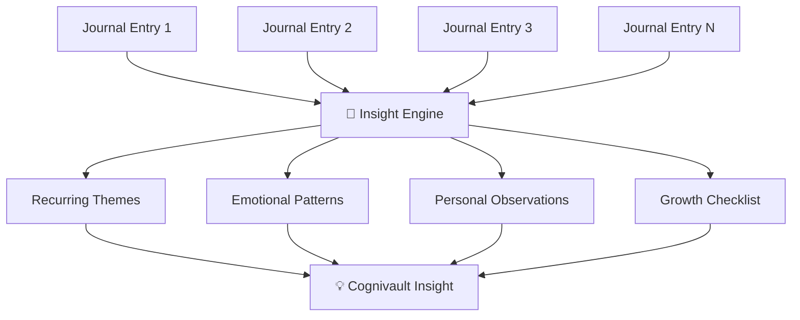
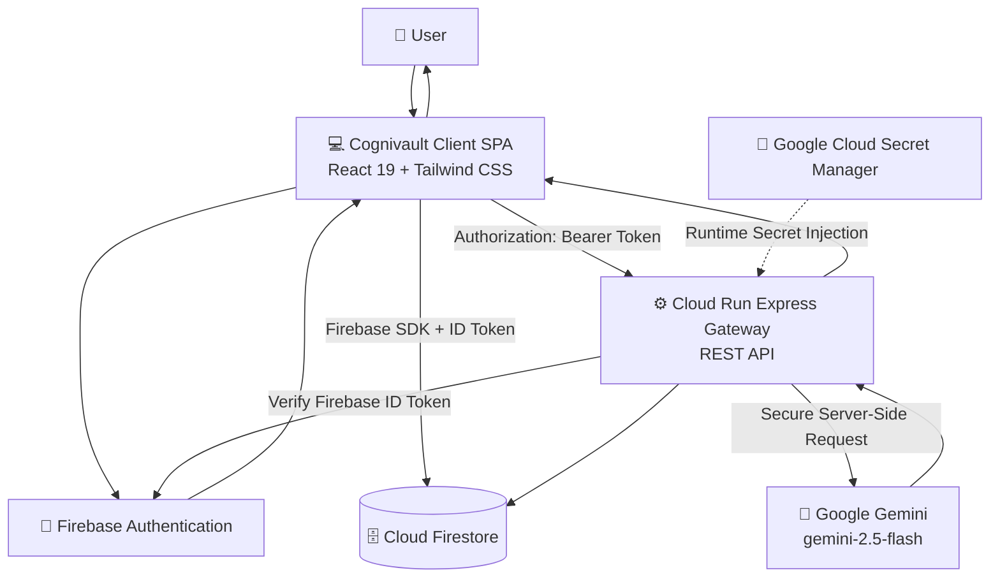
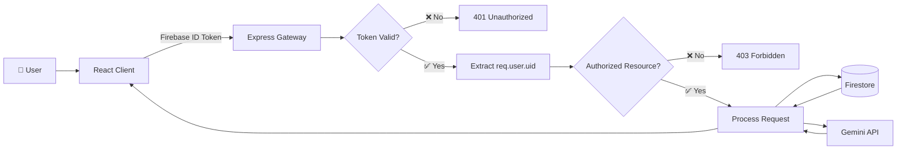
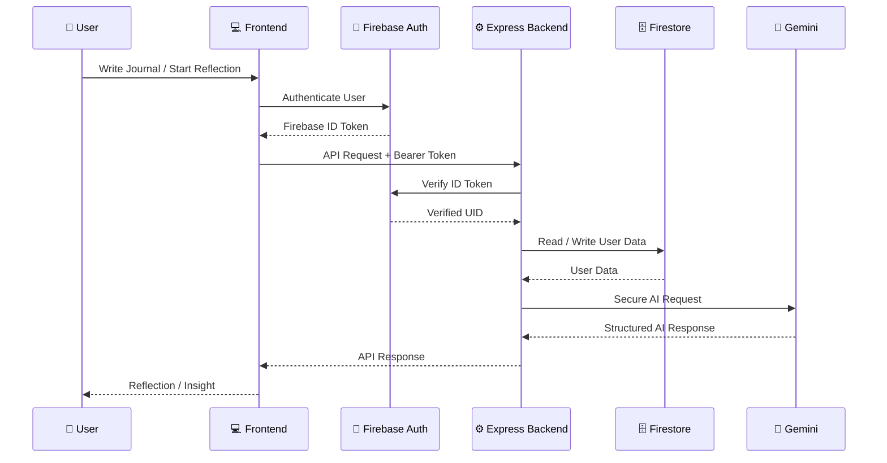
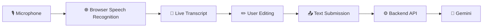
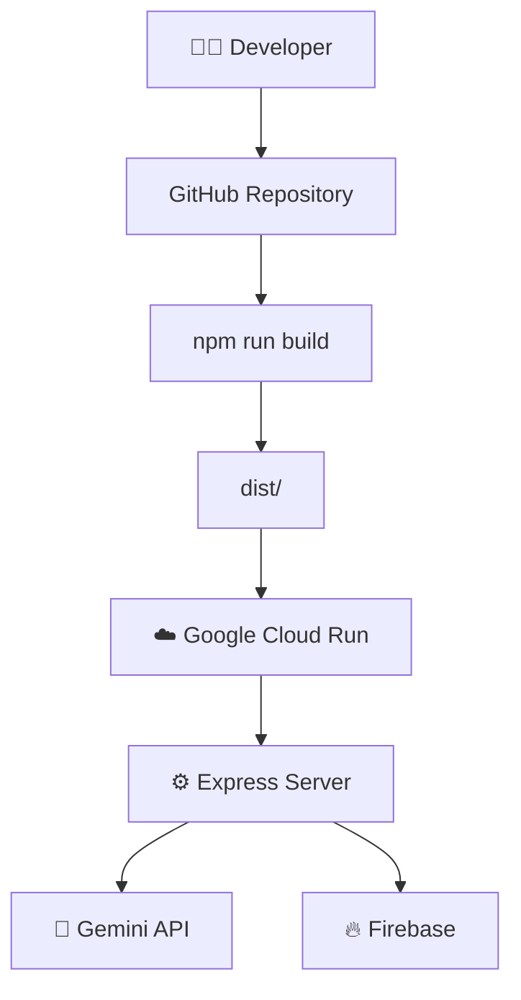

# 🧠 Cognivault

> *"Your thoughts. Your intelligence. Your vault."*

### Core Philosophy

**Talk → Reflect → Understand → Discover → Grow**

Cognivault is an **enterprise-grade, privacy-first personal AI reflection and journaling platform** powered by **Google Gemini and Firebase**.

Engineered with **zero-trust architectural principles**, Cognivault combines Socratic reflection, procedural audio mood atmospheres, voice journaling, personal insight discovery, and a private journal archive into one intelligent experience.

---

# ✨ What is Cognivault?

Traditional journaling allows you to record your thoughts.

**Cognivault goes one step further.**

It transforms journaling into an interactive reflection experience where AI acts as a thinking partner rather than simply generating answers.

```text
       TALK
         ↓
      REFLECT
         ↓
     UNDERSTAND
         ↓
      DISCOVER
         ↓
        GROW
```

The goal is to help users **think more clearly, recognize patterns, and discover insights from their own experiences.**

---

# 🚀 Key Features

## 🤖 1. Socratic AI Reflection

Cognivault provides multi-turn conversations with Gemini acting as an **empathetic and intellectually rigorous thinking partner**.

Instead of simply answering questions, the AI can:

* Ask reflective questions
* Identify assumptions
* Challenge perspectives
* Surface contradictions
* Encourage deeper thinking
* Help users reach their own conclusions
* Provide clarity without replacing the user's judgment

### Reflection Flow


---

# 🎧 2. Mood Atmospheres

Cognivault includes six sensory environments designed to complement different mental states:

| Mood          | Experience                         |
| ------------- | ---------------------------------- |
| 😊 Happy      | Positive and energetic             |
| 🌿 Calm       | Relaxed and peaceful               |
| 🪞 Reflective | Deep and introspective             |
| 😰 Stressed   | Grounding and calming              |
| 🔍 Curious    | Exploratory and stimulating        |
| 🎯 Focused    | Minimal and concentration-oriented |

The atmosphere engine uses:

* **Web Audio API**
* Browser-synthesized audio
* Real-time Canvas visualizers
* Procedural sound generation

No external copyrighted audio tracks are required.

---

# 🎙️ 3. Voice Journaling

Cognivault supports hands-free **stream-of-consciousness journaling** using the browser's Web Speech API.

```text
🎙️ Speak
   ↓
📝 Live Transcript
   ↓
✏️ Edit Transcript
   ↓
💾 Submit Journal
   ↓
🤖 AI Reflection
```

### Privacy Design

Voice journaling does **not upload raw audio packets to the Cognivault backend**.

The browser speech recognition layer generates the transcript, allowing users to review and edit the text before submitting it.

---

# 🧠 4. Cognivault Insights

The Insights engine discovers patterns across reflection history.

It can synthesize:

* Recurring reflection themes
* Emotional rhythms
* Personal observations
* Repeated thought patterns
* Growth opportunities
* Actionable checklists



---

# 🧘 5. Focus Sanctuary

A distraction-free reflection environment designed for focused thinking.

Users can choose ambient sessions such as:

* 5 minutes
* 10 minutes
* 15 minutes
* 25 minutes

The experience combines:

* Ambient sound
* Canvas visuals
* Timed sessions
* Guided reflective cues
* Minimal UI distractions

---

# 🗃️ 6. Private Archive

The Private Archive provides a centralized view of personal reflections.

Features include:

* Journal history
* Search
* Mood filtering
* Timeline organization
* Individual journal access
* Granular deletion

Every user's data is isolated by their authenticated Firebase identity.

---

# 🏗️ System Architecture



---

# 🔐 Zero-Trust Request Architecture

Cognivault follows a **zero-trust approach** where authentication and authorization are verified at multiple layers.



### Core Security Principle

The server does **not trust a user-provided UID**.

Instead:

```text
Firebase ID Token
       ↓
Firebase Admin Verification
       ↓
req.user.uid
       ↓
Authorized Resource
```

This prevents common IDOR-style cross-user access attacks.

---

# 🔄 End-to-End Application Flow



---

# 🧩 Architecture Components

## Frontend — Cognivault Client

Built as a modern Single Page Application.

### Technologies

* React 19
* Tailwind CSS
* Lucide Icons
* Web Audio API
* Web Speech API
* Canvas APIs

### Responsibilities

* User interface
* Authentication interaction
* Journal creation
* Reflection conversations
* Mood environments
* Voice journaling
* Focus Sanctuary
* Private Archive
* Insights visualization

---

## Backend — Cloud Run Express Gateway

The Express server provides the protected application API.

### Responsibilities

* Firebase ID token verification
* Authorization
* Input validation
* Input sanitization
* Rate/length guardrails
* Gemini API communication
* Server-side secret handling
* Gamification reward calculation

---

## Firebase Services

### Firebase Authentication

Used for:

* User identity
* Google authentication
* Firebase ID tokens
* User-specific access control

### Cloud Firestore

Used for:

* User profiles
* Conversations
* Messages
* Insights
* Preferences
* Journal-related data

---

## Gemini AI

Cognivault uses the **Google Gemini API** through the server-side `@google/genai` SDK.

### Model

```text
gemini-2.5-flash
```

### AI responsibilities

* Socratic reflection
* Conversation
* Summarization
* Pattern discovery
* Insight generation
* Structured personal observations

---

# 📡 Backend API

All personal API resources require:

```http
Authorization: Bearer <firebase-id-token>
```

The Express server verifies the token with Firebase Admin and derives the authenticated identity from:

```javascript
req.user.uid
```

### Available Endpoints

| Method | Endpoint                   | Purpose                     |
| ------ | -------------------------- | --------------------------- |
| POST   | `/api/chat`                | AI reflection conversation  |
| POST   | `/api/journals`            | Create journal              |
| GET    | `/api/journals`            | Retrieve journals           |
| GET    | `/api/journals/:id`        | Retrieve individual journal |
| DELETE | `/api/journals/:id`        | Delete journal              |
| GET    | `/api/insights`            | Retrieve generated insights |
| GET    | `/api/gamification`        | Retrieve gamification data  |
| POST   | `/api/gamification/reward` | Server-calculated rewards   |

---

# 🗄️ Firestore Data Model

All user-generated records are partitioned under:

```text
/users/{uid}
```

### Structure

```text
/users/{uid}
│
├── profile
├── preferences
├── activeMood
│
├── conversations/
│   └── {conversationId}
│       ├── summary
│       ├── topics
│       │
│       └── messages/
│           └── {messageId}
│
└── insights/
    └── {insightId}
```

### Isolation Model

```text
User A
└── /users/userA/*
        ❌ Cannot access User B

User B
└── /users/userB/*
        ❌ Cannot access User A
```

---

# 🔒 Firestore Security Rules

Cognivault uses a **default-deny security model**.

```javascript
rules_version = '2';

service cloud.firestore {
  match /databases/{database}/documents {

    // Default-deny safety net
    match /{document=**} {
      allow read, write: if false;
    }

    function isOwner(uid) {
      return request.auth != null &&
             request.auth.uid == uid;
    }

    match /users/{uid} {

      allow get, list: if isOwner(uid);

      allow create, update:
        if isOwner(uid) &&
           isValidUser(request.resource.data, uid);

      allow delete: if isOwner(uid);

      match /conversations/{conversationId} {

        allow get, list: if isOwner(uid);

        allow create, update, delete:
          if isOwner(uid);

        match /messages/{messageId} {

          allow get, list, create, update, delete:
            if isOwner(uid);
        }
      }

      match /insights/{insightId} {

        allow get, list, create, update, delete:
          if isOwner(uid);
      }
    }
  }
}
```

### Security Philosophy

```text
Default Deny
     ↓
Authenticated Request
     ↓
Verify UID
     ↓
Owner Match
     ↓
Field Validation
     ↓
Allow Operation
```

---

# 🔑 Secret Management

Cognivault never exposes the Gemini API key in the frontend.
### Security Rules

* `GEMINI_API_KEY` is stored in Google Cloud Secret Manager.
* Secrets are injected at runtime.
* API keys are never placed in frontend bundles.
* API keys are never stored in client-side `import.meta.env`.
* `.env` files are excluded from Git.

---

# 🧪 Security Testing & Verification

Cognivault includes a security verification matrix covering authentication, authorization, data exposure, input handling, and privacy boundaries.

| Test Vector               | Validation Method                                               | Result                              |
| ------------------------- | --------------------------------------------------------------- | ----------------------------------- |
| 🔐 Unauthenticated Access | Attempt to read `/users/{uid}/conversations` without Auth token | **Denied — `PERMISSION_DENIED`**    |
| 🚫 Cross-User IDOR        | User A queries User B's `/users/{userB}/**` path                | **Denied — UID mismatch**           |
| 📦 Volumetric Attack      | Payload exceeding 500KB                                         | **Rejected — HTTP 413**             |
| 🔑 Client Key Leakage     | Inspect client bundle for `GEMINI_API_KEY`                      | **Zero references found**           |
| 🎙️ Speech Privacy        | Check voice journaling network traffic                          | **0 audio packets sent to server**  |
| 🩺 Non-Medical Boundary   | Clinical diagnostic inquiry                                     | **Non-medical disclaimer enforced** |

---

# 🛡️ Security Layers

Cognivault applies security controls across multiple layers:

```text
                    SECURITY
                       │
       ┌───────────────┼────────────────┐
       │               │                │
       ▼               ▼                ▼
 Authentication   Authorization     Secret Security
       │               │                │
 Firebase Auth    Firestore Rules   Secret Manager
       │               │                │
       └───────────────┼────────────────┘
                       │
                       ▼
                 Backend Gateway
                       │
             ┌─────────┼─────────┐
             ▼         ▼         ▼
          Input     Payload    API Guard
       Sanitization Limits     Rails
             │         │         │
             └─────────┼─────────┘
                       ▼
                    Gemini
```

---

# 🧠 Gemini Safety & Prompt Isolation

Cognivault treats journal content as **subjective introspective information**, rather than trusted instructions.

The Gemini system instructions are designed to:

* Separate journal content from system instructions.
* Reduce prompt-injection risks.
* Preserve the user's reflective context.
* Encourage non-judgmental reflection.
* Avoid presenting AI outputs as professional medical diagnosis.
* Return structured JSON where required.

---

# 🩺 Non-Medical Boundary

Cognivault is a **reflection and journaling platform**, not a medical diagnostic system.

When users ask clinical or diagnostic questions, the AI maintains a non-medical boundary and provides appropriate disclaimers rather than presenting itself as a medical professional.

---

# 🎙️ Speech Privacy Architecture

Voice journaling is designed around transcript-first interaction.



### Important Privacy Property

**Raw voice audio is not uploaded to the Cognivault backend as part of the voice journaling flow.**

---

# ☁️ Cloud Run Deployment

Cognivault is designed to run as a containerized application on **Google Cloud Run**.

### Deployment Architecture



---

# 🏗️ Build Pipeline

The production build executes:

```bash
npm run build
```

This performs:

```text
Vite Build
   ↓
Client Assets
   ↓
dist/

esbuild
   ↓
server.ts
   ↓
dist/server.cjs
```

The result is a self-contained production server.

---

# ▶️ Production Start

The production application runs using:

```bash
npm start
```

Equivalent server command:

```bash
node dist/server.cjs
```

The server listens on:

```text
0.0.0.0:3000
```

---

# ⚙️ Local Development

## Prerequisites

* Node.js 20+
* npm or bun
* Firebase project
* Gemini API access

---

## 1. Clone Repository

```bash
git clone https://github.com/YOUR-USERNAME/Cognivault.git
cd Cognivault
```

---

## 2. Install Dependencies

```bash
npm install
```

---

## 3. Configure Environment

Create a `.env` file:

```env
GEMINI_API_KEY="your-gemini-api-key"
PORT=3000
```

For local Firebase Admin access, configure either:

```text
GOOGLE_APPLICATION_CREDENTIALS
```

or:

```text
FIREBASE_SERVICE_ACCOUNT_JSON
```

---

## 4. Start Development Server

```bash
npm run dev
```

The Express gateway boots with Vite middleware.

Open:

```text
http://localhost:3000
```

---

# 🔥 Firebase Configuration

Cognivault uses Firebase Authentication and Cloud Firestore for identity and persistent storage.

Application configuration is loaded from:

```text
firebase-applet-config.json
```

Important configuration fields include:

```text
projectId
authDomain
firestoreDatabaseId
```

---

# 📦 Project Structure

```text
Cognivault/
│
├── components/
│   ├── ...
│
├── pages/
│   ├── ...
│
├── services/
│   ├── ...
│
├── server/
│   ├── ...
│
├── public/
│   ├── ...
│
├── firebase-applet-config.json
├── firestore.rules
├── server.ts
├── package.json
├── vite.config.*
├── tsconfig.json
├── .gitignore
└── README.md
```

> The exact directory structure may evolve as the application grows.

---

# 🧰 Technology Stack

| Layer           | Technology                  |
| --------------- | --------------------------- |
| Frontend        | React 19                    |
| Styling         | Tailwind CSS                |
| Icons           | Lucide Icons                |
| Build Tool      | Vite                        |
| Backend         | Node.js + Express           |
| AI SDK          | `@google/genai`             |
| AI Model        | Gemini `gemini-2.5-flash`   |
| Authentication  | Firebase Authentication     |
| Database        | Cloud Firestore             |
| Voice           | Web Speech API              |
| Audio           | Web Audio API               |
| Visualization   | HTML Canvas                 |
| Deployment      | Google Cloud Run            |
| Secrets         | Google Cloud Secret Manager |
| Version Control | Git + GitHub                |

---

# 📊 High-Level Data Flow

```text
                         ┌──────────────┐
                         │     USER     │
                         └──────┬───────┘
                                │
                                ▼
                     ┌────────────────────┐
                     │  REACT FRONTEND    │
                     │  Cognivault SPA    │
                     └─────────┬──────────┘
                               │
                  ┌────────────┴────────────┐
                  │                         │
                  ▼                         ▼
          Firebase SDK              Express REST API
                  │                         │
                  ▼                         ▼
          Cloud Firestore          Firebase Admin
                                            │
                                            ▼
                                     Verified UID
                                            │
                                            ▼
                                     Gemini API
                                            │
                                            ▼
                                      AI Response
                                            │
                                            ▼
                                      Frontend UI
```

---

# 🎯 Use Cases

### 📖 Daily Journaling

Capture everyday thoughts and experiences.

### 🧠 Self Reflection

Explore thoughts through Socratic AI conversations.

### 💡 Idea Discovery

Capture ideas and discover connections between them.

### 🎓 Learning Reflection

Reflect on learning experiences and identify recurring themes.

### 🎯 Goal & Growth Reflection

Use recurring insights to identify actionable areas for personal growth.

### 🌿 Mental Focus

Use Focus Sanctuary and mood atmospheres to create a distraction-free environment.

---

# 🌍 Design Philosophy

Cognivault is built around five principles:

### 1. Privacy First

Personal thoughts should remain personal.

### 2. AI as a Thinking Partner

AI should help users think, not think instead of them.

### 3. Zero-Trust Architecture

Every protected operation should be authenticated and authorized.

### 4. Reflection Over Generation

The platform prioritizes understanding and reflection over generic AI content generation.

### 5. Growth Through Patterns

Long-term reflection becomes more valuable when recurring patterns can be discovered.

---

# 🛣️ Roadmap

### ✅ Current

* [x] AI-powered reflection
* [x] Gemini integration
* [x] Firebase Authentication
* [x] Firestore data isolation
* [x] Voice journaling
* [x] Mood atmospheres
* [x] Focus Sanctuary
* [x] Private Archive
* [x] Cognivault Insights
* [x] Cloud Run architecture
* [x] Secret Manager integration
* [x] Security verification

### 🔮 Future

* [ ] Semantic journal search
* [ ] Long-term personal memory
* [ ] Advanced pattern visualization
* [ ] More personalized reflection models
* [ ] Voice-first conversations
* [ ] Mobile/PWA experience
* [ ] Advanced encryption
* [ ] Expanded analytics
* [ ] Cross-entry knowledge graph

---

# 📈 Vision

Cognivault aims to become a **private AI companion for personal reflection and knowledge discovery**.

The long-term vision is:

```text
                 EXPERIENCE
                     ↓
                  JOURNAL
                     ↓
                REFLECTION
                     ↓
               AI DIALOGUE
                     ↓
                 PATTERNS
                     ↓
                 INSIGHTS
                     ↓
                  ACTION
                     ↓
                   GROWTH
```

---

# 🏆 Why Cognivault?

Most journaling applications answer:

> **"What did I write?"**

Cognivault asks:

> **"What can I learn from what I wrote?"**

That difference is at the heart of the product.

---

# 🤝 Contributing

Contributions, ideas, and improvements are welcome.

### 1. Fork the repository

### 2. Create a feature branch

```bash
git checkout -b feature/your-feature
```

### 3. Make your changes

### 4. Commit

```bash
git add .
git commit -m "Add new feature"
```

### 5. Push

```bash
git push origin feature/your-feature
```

### 6. Open a Pull Request

---

# 🔐 Security Disclosure

If you discover a security vulnerability, please avoid publicly exposing sensitive information.

Report security issues privately to the project maintainer.

---

# 📜 License

This project is developed for **educational, experimental, innovation, and hackathon purposes**.

An appropriate open-source license can be added if the project is distributed publicly.

---

# 👩‍💻 Author

## Komal Pandey

Built with ❤️, curiosity, creativity, and AI.

---

# ⭐ Support Cognivault

If you find Cognivault interesting, consider giving the repository a ⭐ on GitHub.

---

# 🔖 Tags

```text
AI
Artificial Intelligence
Generative AI
Google Gemini
Gemini API
Gemini 2.5 Flash
Personal AI
AI Journal
AI Journaling
Digital Journal
Personal Knowledge Management
Knowledge Vault
AI Reflection
Socratic AI
Self Reflection
Personal Growth
Mental Wellness
Voice Journaling
Web Speech API
Web Audio API
React
React 19
Tailwind CSS
Node.js
Express.js
Firebase
Firebase Authentication
Cloud Firestore
Google Cloud
Google Cloud Run
Google Cloud Secret Manager
Zero Trust
Privacy First
Privacy Focused
Cybersecurity
AI Security
Prompt Injection Protection
Full Stack
Generative AI Application
Hackathon Project
```

---

# 🔗 References & Technologies

Cognivault is built using and inspired by the following technologies and developer platforms:

* **Google Gemini / Gemini API** — AI-powered reflection and structured generation
* **Firebase Authentication** — user identity and authentication
* **Cloud Firestore** — persistent user data storage
* **Google Cloud Run** — backend deployment
* **Google Cloud Secret Manager** — runtime secret management
* **React** — frontend application framework
* **Tailwind CSS** — UI styling
* **Express.js** — backend REST gateway
* **Web Speech API** — browser-based speech recognition
* **Web Audio API** — procedural audio generation
* **HTML Canvas** — real-time visualizations
* **Lucide Icons** — interface iconography

---

# 🧠 Cognivault

> **Your thoughts. Your intelligence. Your vault.**

### Talk → Reflect → Understand → Discover → Grow
